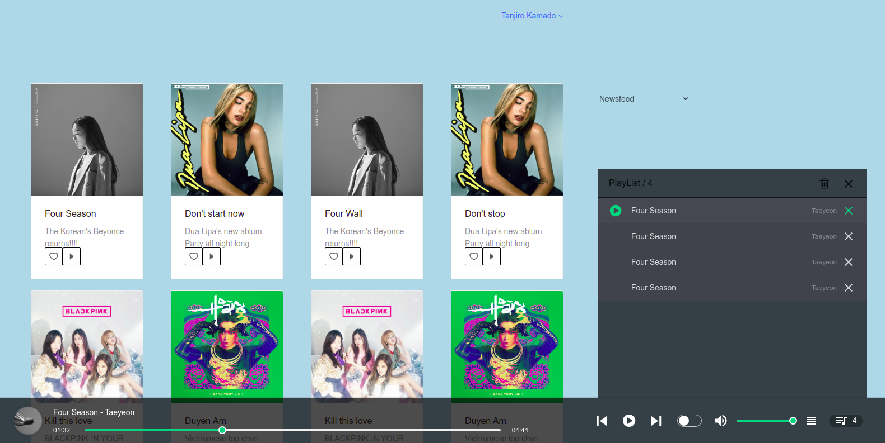

# tienthegainz
HEDSPIFY - Ablum Audio

# How to install
**There is problem with `docker-compose up`**
*****
- Build image: `docker-compose build`
- Search: `docker image -ls` and find IMAGE ID of `react-itss1_react` image
- Run: `docker run -it [IMAGE ID]`

# How to pull request
****
- Please fork into your own repo
- Make issue and link it to your pull request

# UI
****

# Features
****
- Album collections
- Audio player
- Newsfeed
- Search ablum
